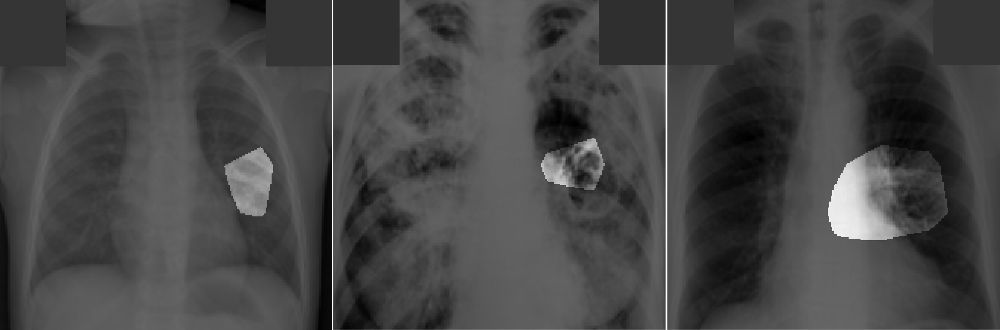

# Deep Learning for Tuberculosis #

The TB-Net model provided here is intended to be used as a reference model that can be built upon and enhanced as new data becomes available. It is currently at a research stage and not yet intended as a production-ready model (not meant for direct clinical diagnosis). We are working continuously to improve it as new data becomes available. Please do not use TB-Net for self-diagnosis; seek help from your local health authorities.**

	
	 
	<em>Example chest x-ray images from 3 different patients, and their associated critical factors (highlighted in white) as identified by GSInquire. In this example, all three lungs have been diagnosed with tuberculosis.</em>

## Introduction ##

Tuberculosis (TB) remains a significant global health challenge and is the leading cause of death from an infectious disease. Early detection through screening high-risk populations is crucial for effective treatment, and chest X-ray (CXR) imaging is the most widely-used diagnostic tool. To address the shortage of trained healthcare workers in resource-limited settings, there has been growing interest in AI-based TB screening solutions.
TB-Net: An AI-Based Screening Solution

Motivated by the urgent need for improved TB detection, we introduce TB-Net, a self-attention deep convolutional neural network designed specifically for TB case screening. TB-Net utilizes machine-driven design exploration to develop a highly customized deep neural network architecture with attention condensers. This model has undergone explainability-driven performance validation to ensure its decision-making process is transparent and reliable.

## Performance and Validation ##

Experiments conducted using the Tuberculosis Chest X-Ray benchmark dataset demonstrate that TB-Net achieves outstanding performance with accuracy, sensitivity, and specificity rates of 99.86%, 100.0%, and 99.71%, respectively. Validation by two board-certified radiologists, with over 10 and 19 years of experience, confirmed consistency between their interpretations and the critical factors identified by TB-Net for TB case detection.

## Important Note ##

The TB-Net model provided here is intended as a reference model for further development and enhancement as new data becomes available. It is currently at a research stage and not intended for production use or direct clinical diagnosis. Continuous improvements are being made as more data becomes available. Please do not use TB-Net for self-diagnosis; always seek assistance from your local health authorities.
Example Use Case

The image below shows chest X-rays from three different patients, each diagnosed with TB. Critical factors identified by TB-Net (highlighted in white) illustrate the model's interpretative capability for root cause analysis of TB in sample images.

## WHO Recommendation ##

The World Health Organization (WHO) recently recommended that for individuals aged 15 years and older in populations where TB screening is advised, computer-aided detection (CAD) approaches may replace human readers for interpreting digital chest X-rays for TB screening and triage.

## Table of Contents ##
1. [Requirements](#requirements) to install on your system
2. [Dataset recreation](#dataset-recreation)
3. Steps for [training, evaluation and inference](docs/train_eval_inference.md) of TB-Net
4. [Results](#results)
5. [Links to pretrained models](docs/models.md)

## Requirements ##

The main requirements are listed below. A full list can be found in "requirements.txt".

* Tested with Tensorflow 1.15
* OpenCV 4.5.1
* Python 3.6
* Numpy 1.19.5
* Scikit-Learn 0.24.1

For OpenCV, you may need to install some system dependencies:
`apt-get install -y --no-install-recommends libgl1-mesa-glx libglib2.0-0`

Python packages can be installed with:
`python3 -m pip install -r requirements.txt`

## Dataset Recreation ##

To recreate the dataset that we used for our experiments, follow these steps:
1. Download the original dataset [here](https://www.kaggle.com/tawsifurrahman/tuberculosis-tb-chest-xray-dataset).
2. Extract the files.
3. Run the `create_dataset.py` script, making sure to point the 'datapath' argument at the root directory containing the extracted files. This script will perform pre-processing on all the images, converting them into the format we used. 
4. Wait for the processing to complete.

## Results ##

These are the final results for TB-Net on the test dataset.
The test dataset contains 348 normal samples and 345 tuberculosis samples.

<table class="tg">
  <tr>
    <th class="tg-7btt" colspan="5">TB-Net Details</th>
  </tr>
  <tr>
    <td class="tg-7btt">Accuracy</td>  
    <td class="tg-7btt">Sensitivity</td>
    <td class="tg-7btt">Specificity</td>
    <td class="tg-7btt"># Params (M)</td>
    <td class="tg-7btt">MACs (G)</td>  
  </tr>
  <tr>
    <td class="tg-c3ow">99.86</td>
    <td class="tg-c3ow">100.0</td>
    <td class="tg-c3ow">99.71</td>
    <td class="tg-c3ow">4.24</td>
    <td class="tg-c3ow">0.42</td>
  </tr>
</table>

